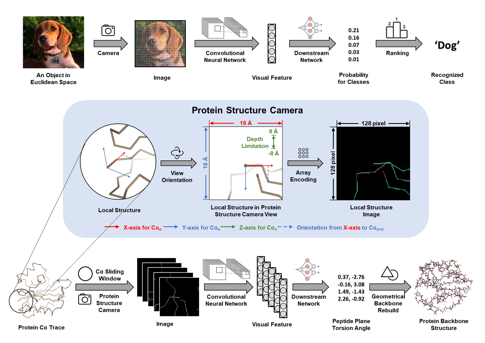

# DeepPSC
This package is a part of protein backbone structure reconstruction tool developed in: DeepPSC (protein structure camera): computer vision-based protein backbone structure reconstruction from alpha carbon trace as a case study.
It includes the PSC tool that convert PDB file of protein alpha-carbon trace to images, together with a deep neural network architechture for prediction based on converted images.

Contact: Xing Zhang, 201810107475@mail.scut.edu.cn
